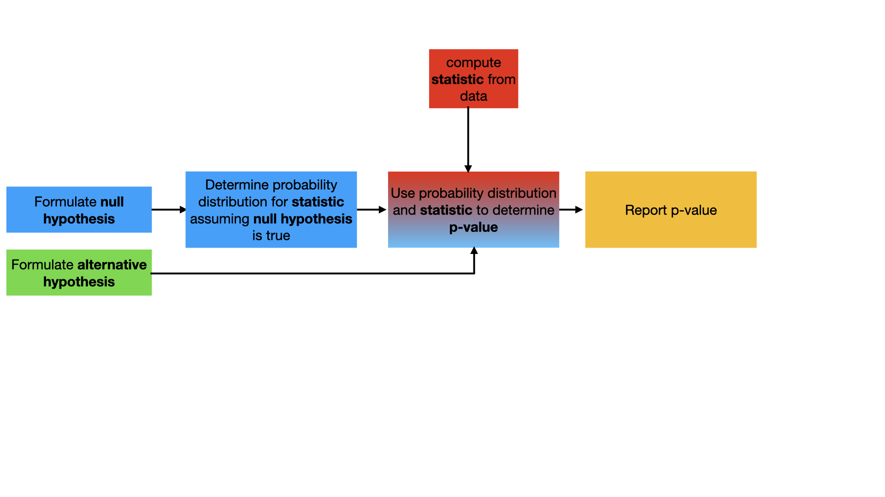

# Comparison of two variances

Now that we have established what distribution we are sampling from when we calculate the ratio between two sample variances lets use this statistic within our now familiar workflow for a hypothesis test:



In the code on the left, I have set up two NumPy arrays called `data1` and `data2`.  `data1` contains 10 samples from one distribution, while `data2` contains 10 samples from a second different distribution.  Your task is to run a hypothesis test to determine if the variance for the distribution from which the data in `data1` is obtained is smaller than the variance for the distribution from which the data in`data2` was obtained.

To perform this test you will need to do the following:

* You will need to complete the function called  `sample_variance`.  This function takes in a NumPy array called `data`.  You should add code to calculate and return the sample variance from the data in `data` using:

^2\right])

* You will then need to complete the function called `testStatistic`.  This function takes in two NumPy arrays `data1` and `data2`.  You should calculate a sample variance for each data set using your `sample_variance` function.  You should then return the following test statistic from the data:

}{\left(\frac{S_2^2}{\sigma_2^2}\right)}=\frac{1}{\lambda_0}\frac{S_1^2}{S_2^2})

 and  in this expression are the square roots of the sample variances for the data in `data1` and `data2` respectively.  Furthermore, as we are testing if the true variances are equal, .
 
To complete the task you will need to use the statistic calculated by testStatistic to calculate the __p-value__.  If your statistic is a sample from an f-distribution with `(v1,v2)`-degrees of freedom and your test statistic is F you can get this __p-value__ using:

````
pval = scipy.stats.f.cdf( F, v1, v2 )
````

Once you complete these functions the program will perform the hypothesis test for you.
